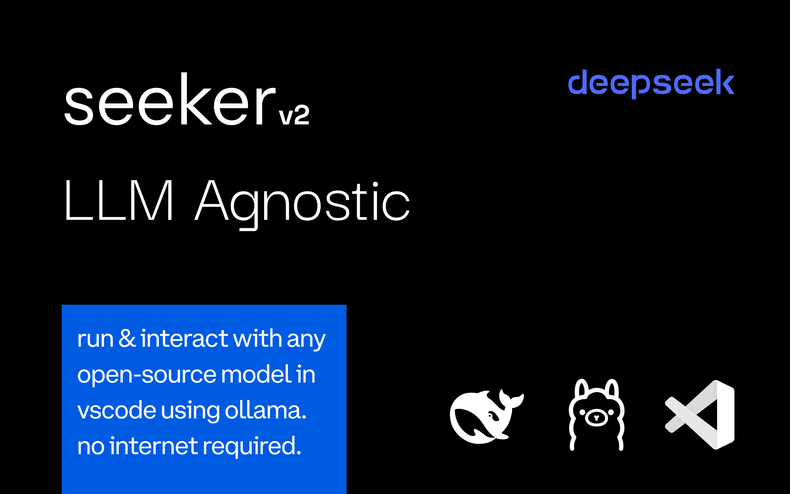
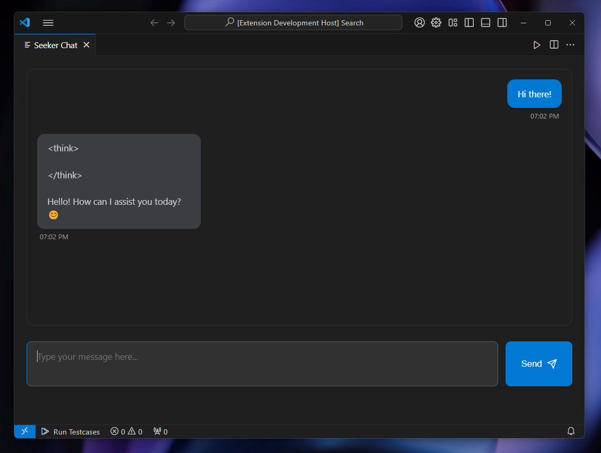
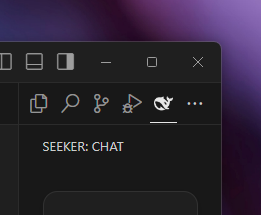
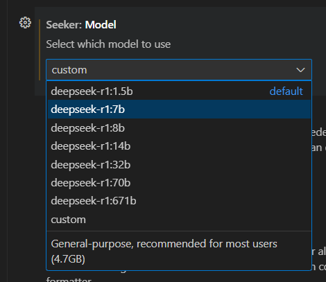
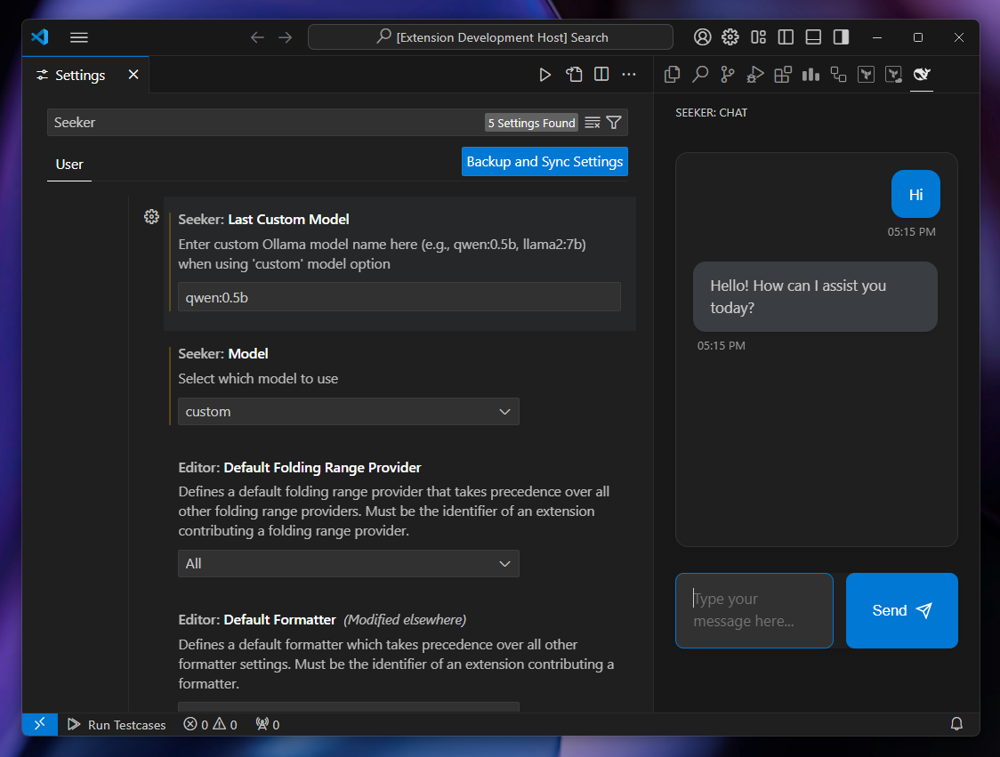
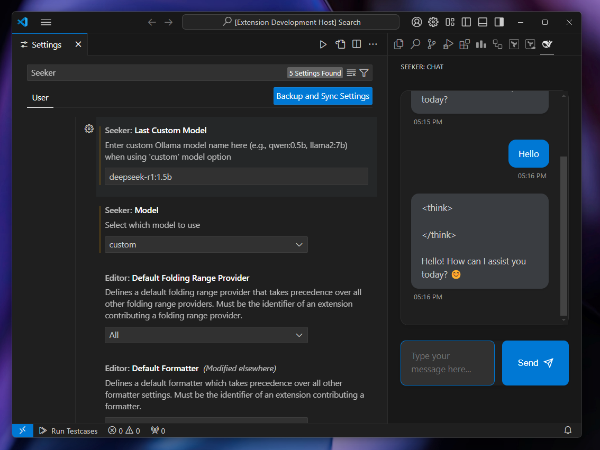
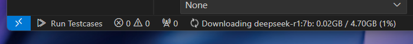

<br>
<div style="display: flex; flex-direction: column; gap: 20px;">
  <div style="display: flex; justify-content: space-between;">
    
    
  </div>

</div>
<br>

# Seeker: DeepSeek-R1 (+ other LLMs) Integration for VS Code

Seeker enables seamless interaction with DeepSeek-R1 reasoning models directly within Visual Studio Code, leveraging the power of Ollama's local runtime. Designed for privacy, performance, and usability, Seeker offers a modern AI-assisted coding experience with no internet connection required. Whether you’re working on resource-constrained hardware or high-end systems, Seeker supports a range of DeepSeek-R1 models to fit your needs. [Published here.](https://marketplace.visualstudio.com/items?itemName=SatwikSingh.seeker)

---

## Key Features

> 🚀 **NEW:** Seeker is now **LLM Agnostic**!  
> Supports all models available through Ollama, including Llama, DeepSeek, Gemma, and Mistral.

- **Local Model Execution**: Run DeepSeek-R1 models entirely on your local machine using Ollama runtime. No data ever leaves your environment.
- **LLM Agnostic**: Compatible with any model available through Ollama (Llama, DeepSeek, Gemma, Mistral, etc.)
- **Model Flexibility**: Supports all DeepSeek-R1 model sizes—from 1.5B to 671B parameters.
- **Privacy-First AI**: Offline functionality ensures complete data privacy.
- **Integrated Chat Interface**: Engage with a clean, modern chat interface embedded directly into VS Code.
- **Hardware-Based Performance**: Select models based on your machine’s capabilities.
- **Context-Aware Assistance**: Enhance productivity with AI-driven insights tailored to your coding environment.

---

## DeepSeek-R1 Model Overview

DeepSeek-R1 is DeepSeek’s first-generation reasoning model series, rivaling the performance of OpenAI-o1 across diverse tasks like mathematics, programming, and logical reasoning. The series includes distilled variants optimized for smaller hardware footprints, as well as massive server-grade models for maximum capability.

### Available Models

<div align="center">

| Model Name | Parameters | Model Size | Use Case |
|:----------:|:----------:|:----------:|:----------:|
| DeepSeek-R1-Distill-Qwen-1.5B | 1.5B | 1.1GB | Basic tasks, resource-constrained systems |
| DeepSeek-R1-Distill-Qwen-7B | 7B | 4.7GB | General-purpose, recommended for most users |
| DeepSeek-R1-Distill-Llama-8B | 8B | 4.9GB | Slightly more complex tasks, moderate hardware |
| DeepSeek-R1-Distill-Qwen-14B | 14B | 9.0GB | Advanced reasoning, larger models |
| DeepSeek-R1-Distill-Qwen-32B | 32B | 20GB | High-performance workloads, AI research |
| DeepSeek-R1-Distill-Llama-70B | 70B | 43GB | Complex reasoning, enterprise-grade usage |
| DeepSeek-R1 | 671B | 404GB | Server grade, maximum capability |

</div>

---

## Requirements

1. **Ollama**: Install Ollama from [ollama.ai](https://ollama.ai/) to enable local model execution.
2. **Hardware**: Ensure sufficient system resources based on your chosen model.
3. **Visual Studio Code**: Ensure you have the latest version installed.

---

## Installation

### Step 1: Install Seeker
- Download and install Seeker from the VS Code Marketplace or via the VSIX file.

### Step 2: Set Up Ollama
- Download and install Ollama from [ollama.ai](https://ollama.ai).
- [Optional] Use the following command to download your preferred DeepSeek-R1 or any other model:

```bash
ollama run deepseek-r1:1.5b   # Smallest model
ollama run deepseek-r1:7b     # Recommended model

# Seeker supports all Open Source LLMs available on Ollama
ollama pull llama2:7b      # Meta's Llama 2
ollama pull mistral:7b     # Mistral AI
ollama pull gemma:7b       # Google's Gemma
```

---

## Usage

1. **Open Seeker in VS Code**:
   - Launch Visual Studio Code.
   - Press `Ctrl+Shift+P` (Windows/Linux) or `Cmd+Shift+P` (Mac).
   - Select **Seeker: Query**.

2. **Model Selection**:
   - Default model: `deepseek-r1:1.5b`.
   - Change model via VS Code settings:
     - Open settings and search for “Seeker”.
     - Select from preset models or choose "custom"
     - For custom models, enter any Ollama model name (e.g., `qwen:0.5b`, `mistral:7b`).

3. **Start Chatting**:
   - Engage with chosen models in a modern, intuitive interface.
   - Real-time responses with streaming.
   - Keyboard shortcuts (Enter to send, Shift+Enter for newline)

---
## Running Seeker

## Screenshots  
<br>
<div style="display: flex; flex-wrap: wrap; justify-content: center; gap: 20px;">
  
  <div style="width: 30%;">
    <a href="ss/SS1.png" target="_blank">
      
    </a>
    <p align="center"><b>Main Chat UI</b></p>
  </div>

  <div style="width: 30%;">
    <a href="ss/sidebar.png" target="_blank">
      
    </a>
    <p align="center"><b>Sidebar Menu</b></p>
  </div>

  <div style="width: 30%;">
    <a href="ss/custom-models.png" target="_blank">
      
    </a>
    <p align="center"><b>Model Selection</b></p>
  </div>
  
  <div style="width: 30%;">
    <a href="ss/customdemo1.png" target="_blank">
      
    </a>
    <p align="center"><b>Custom Model Demo 1</b></p>
  </div>

  <div style="width: 30%;">
    <a href="ss/customdemo2.png" target="_blank">
      
    </a>
    <p align="center"><b>Custom Model Demo 2</b></p>
  </div>


  <div style="width: 30%;">
    <a href="ss/statusbar.png" target="_blank">
      
    </a>
    <p align="center"><b>Status Bar Progress</b></p>
  </div>

</div>
<br>


---

## Known Issues

- **First-Time Setup or Model Switching**: Initial model downloads may take some time.
- **Memory Usage**: Ensure your system meets the requirements of your chosen model.
- **Download Issues**: If downloads fail or get interrupted, you may need to:
  1. Stop Ollama service (or quit the extension)
  2. Delete contents of `~\.ollama\models\blobs` to remove partial downloads
  3. Restart Ollama service
  4. Try downloading again
- **Manual Model Cleanup**: To free up disk space, you can:
  1. Stop Ollama service (or quit the extension)
  2. Delete contents of `~\.ollama\models\blobs`
  3. Restart Ollama service

---

## Why Seeker?

### Modern Interface  
- Sleek sidebar integration with custom icon  
- Clean chat UI with message timestamps  
- Auto-resizing message input  
- VS Code theme integration  

### Model Management  
- Live download progress in status bar  
- Automatic model switching  
- Download size and progress tracking  
- Custom model support  

### Privacy & Performance  
- All processing done locally  
- No internet connection required  
- Efficient stream-based responses  
- Automatic resource cleanup  

---

## License

Seeker is licensed under the MIT License, allowing for commercial use, modifications, and derivative works. For details, see the [LICENSE](LICENSE) file. Individual model licenses apply based on your chosen LLM.

DeepSeek-R1 models are similarly available for commercial use and modification, with additional licensing information for Qwen and Llama-derived models:
- **Qwen Models**: Based on Apache 2.0 License.
- **Llama Models**: Licensed under Llama3 series licenses.

---

## Contributing

Contributions are welcome! If you have ideas, bug fixes, or feature requests, feel free to submit a Pull Request or open an issue.

---

## Acknowledgments

- **DeepSeek AI**: For developing the cutting-edge DeepSeek-R1 models.
- **Ollama**: For providing a seamless local runtime.
- **Model Creators** : For the open-source models.

---

Experience privacy-focused AI assistance with any LLM, right in your editor with Seeker.


